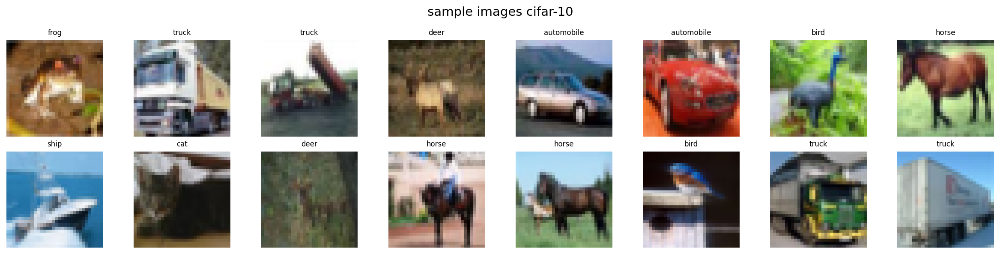
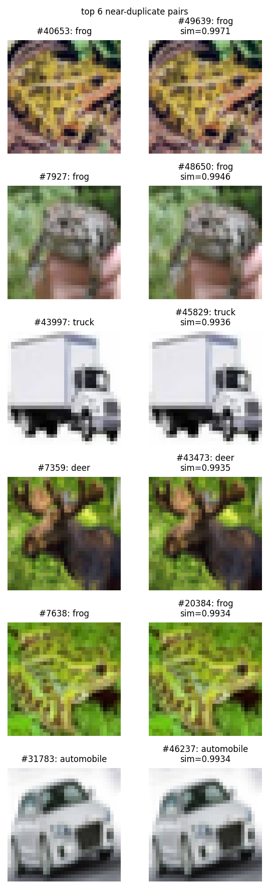
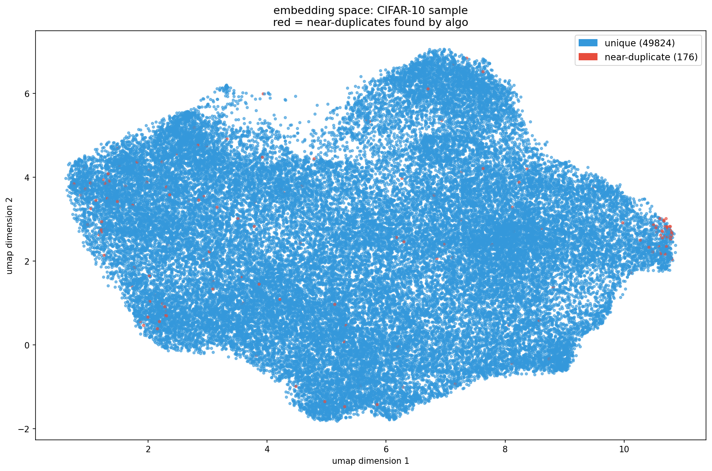
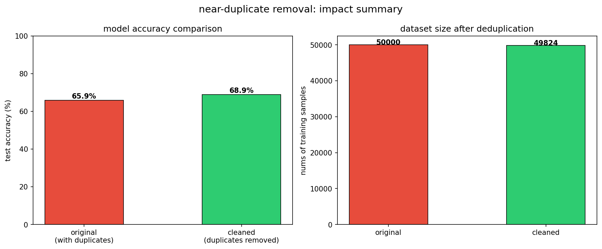

# near-duplicate image detection in ml datasets

**the problem** ml models trained on datasets with near-identical images
waste labeling budget and learn redundant patterns. finding these duplicates
manually in a dataset of millions is impossible

## my approach

1. pass images through ResNet18 (pretrained) to get 512-dim embeddings
2. normalize vectors and compute cosine similarity between all pairs
3. flag pairs with similarity > 0.98 as near-duplicates
4. compress to 2D with UMAP to visualize the embedding space
5. compare model accuracy before and after cleaning

## results

removing 176 near-duplicates from 50,000 images (0.4% of dataset)
improved classifier accuracy from 65.9% to 68.9% (+3.01%)

## visualizations

### sample images from CIFAR-10

### near-duplicate pairs found

### embedding space (UMAP)

### impact summary

